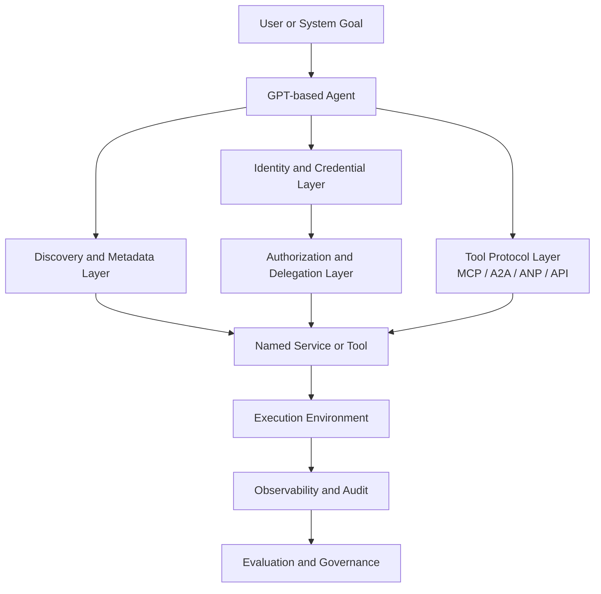
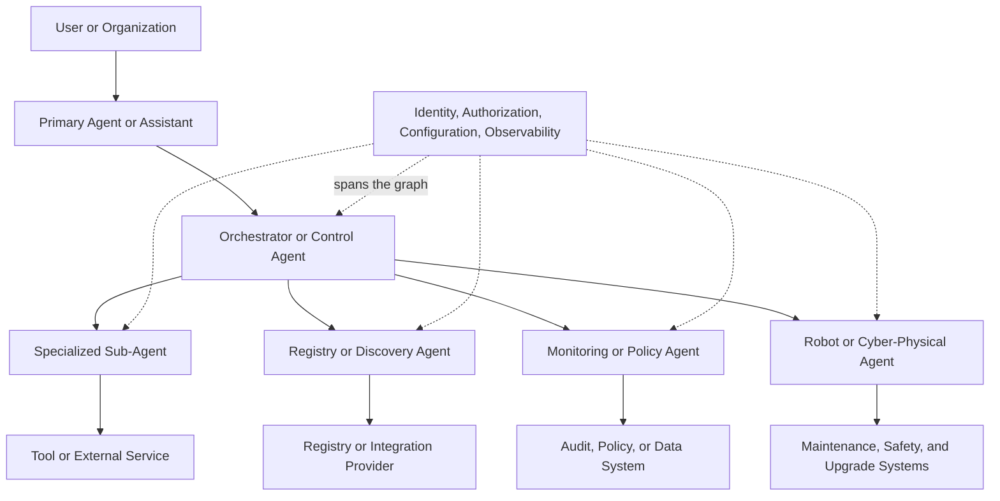
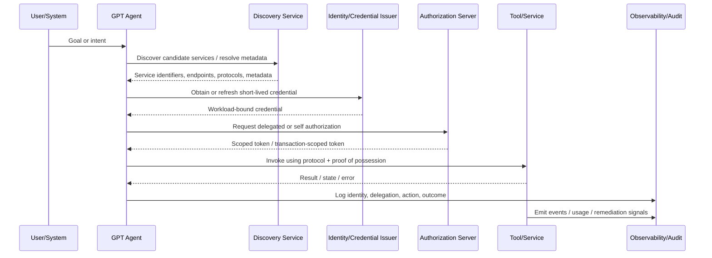

# Agent Internet RFCs Review: Toward a Multi-Agent Internet

## Executive Summary

The emerging “multi-agent Internet” envisions AI agents that can discover services, authenticate across domains, invoke tools, and coordinate with other agents at Internet scale. The draft analyses provided here suggest that this future is technically plausible, but not yet well enough specified to support safe, interoperable deployment.

Three draft texts illuminate complementary parts of the problem. The **AgentDNS** draft proposes a DNS-like naming and discovery layer for agents and tools, including resolution and protocol metadata, while also extending into authentication, billing, and proxying. The **AI agent authentication and authorization** draft argues that agents should be treated as workloads, allowing existing identity and authorization standards such as WIMSE, SPIFFE, OAuth 2.0, and Shared Signals to provide the trust and control fabric. The **NetConfBench / LLM benchmark** draft contributes an evaluation perspective, showing that agent ecosystems also need realistic, tool-mediated, interactive benchmarks rather than static prompt tests.

Taken together, these drafts imply a useful position: a multi-agent Internet should be built as a **layered ecosystem**. Discovery, identity, authorization, execution, and evaluation are all necessary, but they should not be collapsed into one root service without stronger security, privacy, and governance mechanisms. In particular, the analyses consistently show that centralized discovery-plus-auth-plus-billing architectures create concentrated trust and operational risk, while agent autonomy creates a need for auditable, least-privilege, dynamically revocable authorization.

This review takes the position that GPT-based agents can participate in a multi-agent Internet if four conditions are met:

1. **Discovery is separated from trust-sensitive enforcement functions where possible.**
2. **Authentication and authorization rely on existing workload identity and OAuth-based mechanisms rather than proprietary agent-only schemes.**
3. **Tool and service interactions are constrained by verifiable metadata, least-privilege tokens, and strong observability.**
4. **Claims about interoperability or autonomy are validated through realistic benchmarks with interactive tool interfaces and functional outcomes.**

The result is not yet a complete standard architecture. It is better understood as an emerging stack: discovery and metadata on one layer, identity and delegated authorization on another, tool protocols and invocation semantics on another, and benchmarking and governance across all of them. The path forward is therefore not to standardize an all-in-one “agent Internet root,” but to narrow scope, define minimum interoperable surfaces, and ground deployment in security, privacy, and governance discipline.

This layered view becomes even more important once agents are deployed in hierarchical graphs rather than as isolated endpoints. In that setting, discovery, delegation, configuration, and observability must remain coherent across multiple levels of control.

---

## Background

### The emerging problem space

All three drafts begin from a similar practical reality: AI agents are moving from isolated chat interactions toward autonomous or semi-autonomous participation in broader digital environments. In that environment, agents need to do more than generate text. They need to:

- identify and authenticate themselves,
- discover external tools and services,
- invoke those services over different protocols,
- act on behalf of users or systems,
- preserve authorization context across hops,
- and be evaluated on real tasks rather than static outputs.

The AgentDNS draft frames this as an “agent internet” problem. It argues that current agent ecosystems lack a standardized naming and discovery infrastructure for cross-vendor agent and tool invocation. Its proposal is a globally unique naming scheme such as `agentdns://{organization}/{category}/{name}`, backed by service discovery, resolution, and additional centralized functions including authentication and billing.

The AI agent authentication draft addresses a different but adjacent problem: how to authenticate and authorize agents safely. It proposes that agents be treated as workloads and that existing standards—especially WIMSE, SPIFFE, OAuth 2.0, and Shared Signals—be composed rather than replaced. This draft is explicit that it does not define a new protocol; instead, it provides a framework.

The NetConfBench / LLM benchmark draft addresses how such agents should be assessed. It argues that static or syntax-only evaluation is inadequate for autonomous systems that must inspect state, use tools, issue commands, receive feedback, and produce functional outcomes. It therefore proposes an emulator-based benchmark with a minimal tool interface and multiple forms of scoring, including command correctness and testcase success.

### The core architectural question

Across the draft set, the key question is not whether agents can be connected, but **how much of the resulting ecosystem should be centralized, standardized, and trusted**.

- The AgentDNS draft bundles naming, discovery, metadata, proxying, authentication, and billing in one root-oriented architecture.
- The AI agent authentication draft instead decomposes identity and authorization into established security layers.
- The benchmark draft implicitly supports decomposition by separating agent reasoning, tool interaction, environment state, and evaluation.

This review therefore treats the multi-agent internet as a layered architecture problem rather than a monolithic platform problem.

---

## Synthesis of the Draft Analyses

### 1. Discovery, naming, and service metadata are necessary

The AgentDNS analysis identifies a real gap: MCP, A2A, and similar protocol efforts improve interoperability at the interaction level, but do not by themselves provide a global naming and discovery system. The draft’s proposed identifier format —

- `agentdns://{organization}/{category}/{name}`

— captures the intuition that agents need stable names decoupled from changing endpoints, much as DNS decouples names from IP addresses.

This is a meaningful contribution at the conceptual level. The analysis highlights several plausible benefits:

- stable service identity,
- natural-language discovery,
- richer metadata than conventional DNS,
- protocol-awareness for services supporting MCP, A2A, ANP, and related mechanisms,
- and endpoint indirection via resolution.

However, the same analysis also makes clear that the proposal is currently architectural rather than implementable. It does not adequately define:

- metadata schemas,
- registration protocols,
- resolution APIs,
- token models,
- validation rules,
- trust anchors,
- or governance of the namespace.

The central insight is therefore sound: **the multi-agent internet needs a discovery and metadata layer**. The current AgentDNS proposal is too broad and centralized to serve as a safe baseline in its present form.

### 2. Identity and authorization should be treated as workload security problems

The AI agent authentication analysis is more mature in one important respect: it avoids inventing a wholly new identity system. Its core conceptual move is that an AI agent should be modeled as a workload. That allows existing patterns to be reused:

- WIMSE identifiers or SPIFFE IDs for identity,
- short-lived cryptographic credentials for authentication,
- mTLS where transport-layer identity is sufficient,
- WIMSE proof-of-possession tokens or HTTP Message Signatures where application-layer continuity is needed,
- OAuth 2.0 for delegated authorization,
- token exchange and transaction-scoped tokens for least-privilege propagation,
- and Shared Signals / CAEP / RISC for dynamic remediation.

This framework aligns well with the needs of GPT-based multi-agent systems, because it separates the question “who is this agent workload?” from the question “what is it allowed to do right now, and on whose behalf?” The analysis also correctly identifies static API keys as an anti-pattern and stresses the importance of short-lived credentials, proof of possession, and durable auditing.

At the same time, the analysis notes unresolved issues that matter for agentic systems specifically:

- prompt injection and model-driven misuse are not deeply addressed,
- authenticating an agent workload does not guarantee safe agent behavior,
- multi-hop delegation semantics need more precision,
- and policy interoperability remains out of scope.

Among the three drafts, this is the clearest basis for a trust architecture. It suggests that the multi-agent internet should **compose discovery with existing identity and authorization systems**, not replace them with a centralized proprietary root.

### 3. Interactive evaluation is essential

The benchmark analysis contributes a different but highly relevant insight: if the multi-agent internet is meant to support autonomous tool use, then evaluation must reflect interactive execution.

The NetConfBench / LLM benchmark draft proposes:

- an emulator-based environment,
- a minimal agent-to-environment interface,
- a dataset of tasks with startup state and functional tests,
- and scoring that includes command correctness and functional outcomes.

Even though this benchmark is specific to network configuration, its broader implication is important. A multi-agent internet cannot be judged by static prompt-response quality alone. Agents must be tested on:

- tool selection,
- state inspection,
- iterative adjustment,
- correctness of actions,
- and whether the resulting behavior satisfies the intended goal.

This matters for GPT-based systems because much of their real-world value comes from orchestration rather than text generation alone.

The benchmark draft also points to limitations that carry over to the larger ecosystem:

- some reasoning metrics may be weak if based only on embedding similarity,
- canonical “ground truth” may be too rigid,
- interfaces need clearer specification,
- and governance of benchmark fairness and reproducibility is essential.

Thus evaluation becomes part of the architecture: not a postscript, but a mechanism for validating interoperability and safety claims.

---

## A Layered View of the Multi-Agent Internet

The three analyses support a layered architecture rather than a single root authority.

In this model:

- **Discovery and metadata** help the agent find candidate services.
- **Identity and credentials** establish the agent workload’s cryptographic identity.
- **Authorization and delegation** determine what it may do, for whom, and under what constraints.
- **Tool protocols** define invocation mechanics.
- **Execution environments** produce observable results.
- **Audit and evaluation** validate behavior and support remediation.

This layered interpretation synthesizes the draft set without overstating what any single draft actually standardizes.

It also provides the right abstraction for hierarchical agent graphs, where separate layers are needed to keep delegation trees understandable, governable, and recoverable under failure.

---

## Managing the Complexity of Hierarchical Agent Graphs

The multi-agent internet is not developing as a flat mesh of equal peers. In practice, it is already taking shape as a set of hierarchical agent graphs. Consumer assistants such as Siri, Alexa, Copilot, Gemini, Claude, and ChatGPT connect large user populations to agentic services, while developers and operators continue to build control bots, registries, social layers, and orchestration systems around them. Because these systems are designed and operated by a relatively small number of firms and platforms, hierarchy is already present in the ecosystem even before formal inter-agent standards fully mature.

That hierarchy is deepening as agents gain the ability to delegate work, invoke sub-agents, and spawn specialized workers for bounded tasks. The practical skill is therefore shifting from operating a single agent to operating organizations of agents. This changes the engineering problem. It is no longer enough to reason about one model calling one tool. Operators must reason about chains and trees of control, where authority, credentials, configuration, and observability propagate across multiple layers.

### Observations

- The Internet for agents is growing quickly, driven by mass-market personal assistants and enterprise copilots.
- Agent ecosystems already contain hierarchical control structures because core platforms, registries, and orchestration services are concentrated among a limited set of providers.
- Delegation and sub-agent spawning introduce additional layers of control flow, increasing coordination complexity.
- The operational unit is moving from the single agent to the agent graph or agent organization.

### Current limitations

The ecosystem remains hard to measure. Reliable real-time data about agent usage, interconnection patterns, and operational failures is concentrated among a few major platforms. This limits outside visibility into how agent graphs actually behave at scale. At the same time, many of the enabling commercial services for agents remain early and fragmented. Discovery, integration, evaluation, and data provisioning are emerging markets rather than settled infrastructure.

### Basic functionality requirements

At the most basic level, agents need:

- discoverability,
- communicability,
- and configuration for integrations and tool access.

This is where protocols and registries begin to matter. MCP and A2A address parts of the interoperability problem, but registry infrastructure remains nascent. Public examples exist for MCP registries, while A2A registry efforts appear less operationally mature. Configuration ecosystems such as workflow and integration providers also matter because agent effectiveness often depends less on raw model capability than on the quality of surrounding integration metadata, tool bindings, and execution settings.

### Governance and operational functionality

Once agents participate in layered organizations, users and operators need more than discovery and protocol compatibility. They also need:

- security and access control,
- observability and monitoring,
- scalable orchestration,
- and dependable data and evaluation inputs.

These functions are already being assembled by orchestration vendors and workflow platforms, but they are unevenly standardized. In hierarchical graphs, this gap becomes more serious because failures propagate. A misconfigured parent agent can misdirect whole branches of delegates. A weak observability model can leave operators unable to determine which sub-agent made a decision. A broad credential can become far more dangerous when inherited across multiple delegated steps.

### Future extension to robotics and cyber-physical systems

The problem extends beyond software-only agents. As robots become more flexible and autonomous, they will increasingly operate with attached agent stacks. Self-driving systems, embodied assistants, and industrial robots will require not only inference and planning, but also operations support, maintenance workflows, customer support processes, safety controls, upgrade mechanisms, and configuration lifecycle management.

Model distribution alone is not sufficient. Updating weights is only part of operational reality; configuration often determines whether a system is safe, compliant, and functional in its deployment environment. For that reason, the future multi-agent internet will likely need software-image-like packaging for agents and robots, combining model references, configuration state, policy constraints, integration bindings, and upgrade provenance.

### Architectural implication

Hierarchical agent graphs reinforce the core argument of this review. The more layers of delegation and orchestration the ecosystem contains, the less viable it becomes to rely on informal trust, ad hoc configuration, or opaque platform control. Discovery, identity, authorization, observability, configuration, and upgrade management must all work across chains of delegation. In other words, the multi-agent internet should be designed not just for agent-to-tool interaction, but for the safe operation of nested and evolving agent organizations.

---

## Position

A viable multi-agent internet using GPT should be built as a **federated, layered trust and discovery ecosystem** grounded in existing identity and authorization standards, with narrowly scoped discovery and metadata services and with realistic benchmark-driven evaluation. It should **not** be built, at least on the evidence in the drafts, as a single centralized root that simultaneously controls naming, discovery, proxying, authentication, and billing.

#### 1. The need for discovery is real, but centralization is overextended

The AgentDNS draft correctly identifies a gap in cross-vendor naming and discovery. Agents do need stable identifiers, metadata lookup, and the ability to find services from natural-language descriptions. However, the analysis shows that AgentDNS currently combines too many roles:

- registry,
- search and discovery service,
- resolution service,
- auth broker,
- billing intermediary,
- and traffic proxy.

This concentration creates single-point-of-failure, security, privacy, and governance problems that the draft does not adequately resolve. The analysis explicitly notes tensions around claims of “trustless” behavior in a highly centralized trusted-root design. It also flags inadequate treatment of token design, metadata integrity, namespace governance, ranking neutrality, and dispute handling.

Those weaknesses become more consequential when one agent can orchestrate many others. A centralized design error or trust failure would then propagate across an entire agent graph rather than affecting only a single service lookup.

Therefore, the correct conclusion is not that discovery is unnecessary, but that **discovery should be separated from broader enforcement and marketplace functions unless and until stronger standards exist**.

#### 2. Existing security standards are a better foundation than agent-specific trust shortcuts

The authentication draft provides the strongest basis for deployment. Treating an agent as a workload does not solve every AI-specific risk, but it offers a disciplined security model:

- one stable identity in a trust domain,
- short-lived credentials,
- proof-of-possession mechanisms,
- delegated OAuth authorization,
- token exchange rather than token forwarding,
- and revocation/remediation signals.

This approach is especially important for GPT-based agents because model reasoning is not trustworthy enough to substitute for protocol-level authorization. A GPT agent may plan or request an action, but the surrounding infrastructure must decide whether the action is permitted.

Thus the multi-agent internet should rely on **cryptographic workload identity plus delegated authorization**, not on discovery-layer tokens that are vaguely valid “across services” without precise scoping.

#### 3. Tool interoperability and service discovery are not the same thing

The analyses collectively imply a useful distinction:

- Protocols such as MCP, A2A, and related interfaces help agents and tools communicate.
- Discovery systems help agents find candidate services.
- Authorization frameworks decide whether access is allowed.

Conflating these layers creates ambiguity. The AgentDNS draft sometimes implies that protocol metadata enables autonomous adaptation, but it does not define how protocol-neutral capabilities are represented or how adaptation occurs safely. The benchmark draft, by contrast, shows the value of a minimal and explicit tool interface.

The position of this review is therefore that **the multi-agent internet needs interfaces between these layers, not a collapse of all layers into one system**.

#### 4. Evaluation must constrain architectural claims

The benchmark draft is domain-specific, but its lesson is general. Claims such as “agents can safely discover services using natural language” or “agents can autonomously adapt across protocols” should not be accepted purely as design intent. They should be evaluated in interactive, reproducible settings with measurable outcomes.

The benchmark’s evaluation approach is not perfect, but it reflects an important principle: autonomous agents must be measured on both process and result. In the broader multi-agent internet, this means architecture should be informed by benchmarkable criteria such as:

- discovery precision and safety,
- authorization correctness,
- misuse resistance,
- execution success,
- and auditability.

A GPT-based agent ecosystem without this discipline risks substituting persuasive demos for dependable interoperability.

---

## Reference Architecture Position

The following diagram expresses the review's preferred architecture based on the draft texts.

This architecture intentionally separates:

- discovery from credential issuance,
- credential issuance from authorization,
- authorization from service execution,
- and execution from observability.

It still allows tight integration, but avoids assuming one root service must do everything.

---

## Recommendations

### 1. Narrow the standardization surface for discovery

Based on the AgentDNS analysis, the first step should not be to standardize a global root that includes billing and proxying. Instead, discovery work should focus on a smaller set of functions:

- globally unique service identifiers,
- verifiable service metadata,
- clear distinction between discovery and resolution,
- protocol descriptors for supported interfaces,
- and authenticated metadata publication.

This follows directly from the analysis that the current AgentDNS scope is too broad and underdefined.

### 2. Use workload identity and OAuth-based delegation as the security baseline

The authentication analysis strongly supports using existing standards rather than inventing agent-only mechanisms. A practical baseline would include:

- stable workload identity for each agent,
- short-lived cryptographic credentials,
- proof-of-possession where intermediaries exist,
- OAuth-based delegated authorization,
- token exchange for downstream access,
- and dynamic remediation signals.

This is the strongest grounded path in the provided texts for securing GPT-based agents across domains.

### 3. Treat service metadata as a trust object, not just a directory entry

The analyses indicate that service metadata drives agent decisions. If metadata is wrong or malicious, the agent may select inappropriate tools, leak data, or incur cost.

Therefore metadata should be treated as a high-value trust object requiring at least:

- authenticated publication,
- update integrity,
- versioning,
- provenance,
- and governance for removal or revocation.

This recommendation is consistent with the security and governance concerns raised for AgentDNS and with the trust bootstrapping concerns noted in the auth draft’s discussion of discovery.

### 4. Build explicit governance for namespace, ranking, and dispute handling

AgentDNS raises unavoidable governance issues:

- namespace collisions,
- organization verification,
- abuse handling,
- ranking neutrality,
- pay-for-placement incentives,
- settlement disputes.

Even if the technical mechanisms mature, a multi-agent internet will fail institutionally if these governance questions remain implicit. Governance should therefore be treated as a first-class design component, not deferred until after deployment.

### 5. Make observability and remediation mandatory design elements

The auth draft’s strongest operational contribution is its treatment of observability as a security control. For multi-agent systems, logs should preserve at minimum:

- authenticated agent identity,
- delegated subject where relevant,
- service or tool accessed,
- action and decision,
- timestamp and correlation context,
- and remediation or revocation triggers.

This recommendation also aligns with the benchmark draft’s emphasis on trajectory capture and outcome validation.

It is also essential for hierarchical graphs, where operators need to reconstruct which parent delegated to which child, under what authority, with what inherited configuration.

### 6. Evaluate architecture claims using interactive benchmarks

The benchmark analysis shows that realistic evaluation requires interactive environments and measurable outcomes. The multi-agent internet should adopt this principle beyond networking use cases.

In practice, that means new discovery, trust, and invocation mechanisms should be tested against scenarios involving:

- multi-step task execution,
- service discovery under ambiguity,
- authorization failures and revocations,
- protocol adaptation,
- and malicious or misleading metadata.

Without this, “interoperability” remains largely aspirational.

### 7. Keep human approval for sensitive actions within verifiable authorization flows

Both the auth and benchmark analyses support human-in-the-loop controls for high-impact actions. However, the auth analysis makes a crucial point: local UI confirmation is not enough unless it becomes a verifiable authorization artifact.

In the multi-agent internet, GPT agents should not treat user confirmation as merely conversational state. Sensitive actions should be linked to explicit authorization grants that downstream systems can validate.

### 8. Design explicitly for hierarchical delegation and configuration inheritance

The ecosystem described in this review is increasingly one of agent graphs rather than isolated agents. Standards and implementations should therefore assume:

- parent and child agent relationships,
- bounded delegation,
- inherited but constrained configuration,
- graph-level observability,
- and upgrade paths for both software-only and embodied agents.

This is particularly important for robotics and other cyber-physical extensions, where configuration and maintenance state may be as operationally important as the model itself.

---

## Conclusion

The analyses support a clear position: the multi-agent internet is best approached as a **layered, interoperable trust-and-discovery stack**, not as a monolithic centralized platform.

The added perspective of hierarchical agent graphs strengthens that conclusion. As delegation, orchestration, and embodied deployment expand, the architecture must support not only interoperation between agents and tools, but also safe management of nested agent structures over time.

The AgentDNS draft correctly identifies the need for naming, discovery, and protocol-aware service resolution, but currently overextends into centralized authentication, billing, and proxying without adequate trust, privacy, or governance detail. The AI agent authentication and authorization draft provides a stronger trust foundation by reusing workload identity, OAuth-based delegation, proof-of-possession, and dynamic remediation. The benchmark draft adds an essential constraint: these architectures must be evaluated in interactive, tool-mediated environments with functional outcome measures.

Accordingly, this review's position is that GPT-based agents can participate effectively in a multi-agent internet only if the ecosystem is built on:

- **narrowly scoped discovery and metadata mechanisms,**
- **existing workload identity and authorization standards,**
- **least-privilege and auditable tool invocation,**
- **and benchmarked operational claims.**

What emerges is not a single protocol or platform, but an architectural discipline. The next step is not to crown one root service for the agent internet. It is to define minimum interoperable layers and to connect them with verifiable trust, clear governance, and rigorous evaluation.

---

## References

### Source draft analyses used in this review

1. **AgentDNS analysis**, based on:
   - Name: AgentDNS: A Root Domain Naming System for LLM Agents
   - URL: `https://www.ietf.org/archive/id/draft-liang-agentdns-00.txt`
   - Fetched: `20260310T182839Z`

2. **AI agent authentication and authorization analysis**, based on:
   - Name: AI Agent Authentication and Authorization
   - URL: `https://www.ietf.org/archive/id/draft-klrc-aiagent-auth-00.txt`
   - Fetched: `20260310T182839Z`
   - SHA-256: `7cd9b024265e4b549d0aad8518bd0ddf89be4c2d9bb6f18a2495d8b9a522e52d`

3. **NetConfBench / LLM benchmark analysis**, based on:
   - Name: A Framework to Evaluate LLM Agents for Network Configuration
   - URL: `https://www.ietf.org/archive/id/draft-cui-nmrg-llm-benchmark-01.txt`
   - Fetched: `20260310T182840Z`
   - SHA-256: `d1935177c978d4cb8974de51d87deb6ad92e36854a12a79b3259e32049e604a6`

### Concepts explicitly discussed in the analyses

- DNS
- MCP
- A2A
- ANP
- WIMSE
- SPIFFE
- OAuth 2.0
- OpenID Shared Signals Framework, CAEP, and RISC
- HTTP Message Signatures

## Feedback
The .agent Community (https://agentcommunity.org/about, 3,000+ members, 700+ companies) is going through ICANN's Community Priority Evaluation in the 2026 round to get `.agent` under community governance instead of corporate control. AID works on any domain today, but a community-governed TLD for agents is worth knowing about if you care about who controls the naming layer. Spec is at v1.2 https://aid.agentcommunity.org/docs/specification
